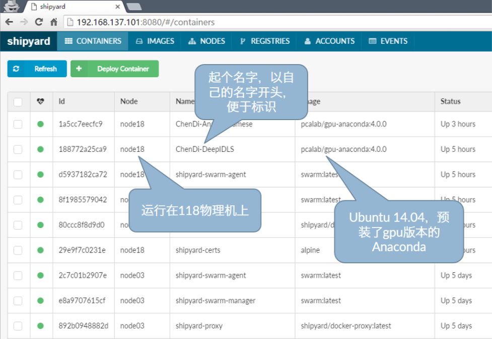

# PCALAB服务器使用指南


## 1. 概述

### 1.1 IP分布

| 服务器 |      IP地址       |            Docker            |      GPU      | CPU  | RAM  |                  备注                  |
| :----: | :---------------: | :--------------------------: | :-----------: | :--: | :--: | :------------------------------------: |
| node01 | `192.168.137.101` | <font color=#42B983>✔</font> |      N/A      |  25  | 25G  | 兼任Shipyard服务器，docker集群管理节点 |
| node02 | `192.168.137.102` | <font color=#42B983>✔</font> |      N/A      |  25  | 25G  |                                        |
| node03 | `192.168.137.103` | <font color=#42B983>✔</font> |      N/A      |  25  | 25G  |                                        |
| node04 | `192.168.137.104` | <font color=#FF6666>✘</font> |      N/A      |      |      |  文件服务器，禁止跑程序，默认禁止登录  |
| node06 | `192.168.137.106` | <font color=#42B983>✔</font> |      N/A      |  16  | 33G  |                                        |
| node07 | `192.168.137.107` | <font color=#FF6666>✘</font> |      N/A      |  16  | 33G  |                                        |
| node08 | `192.168.137.108` | <font color=#42B983>✔</font> |      N/A      |  16  | 33G  |                                        |
| node09 | `192.168.137.109` | <font color=#42B983>✔</font> |      N/A      |  16  | 33G  |                                        |
| node10 | `192.168.137.110` | <font color=#42B983>✔</font> |      N/A      |  33  | 33G  |                                        |
| node11 | `192.168.137.111` | <font color=#42B983>✔</font> |      N/A      |  33  | 33G  |                                        |
| node12 | `192.168.137.112` | <font color=#FF6666>✘</font> |      N/A      |  33  | 33G  |                                        |
| node13 | `192.168.137.113` | <font color=#42B983>✔</font> | Tesla K80 *8  |  25  | 264G |            4047 <u>专用</u>            |
| node14 | `192.168.137.114` | <font color=#42B983>✔</font> |      N/A      |  33  | 66G  |                                        |
| node15 | `192.168.137.115` | <font color=#FF6666>✘</font> |      N/A      |  33  | 66G  |                                        |
| node16 | `192.168.137.116` | <font color=#FF6666>✘</font> |      N/A      |  33  | 66G  |           WindowsServer 2008           |
| node18 | `192.168.137.118` | <font color=#42B983>✔</font> | Tesla K80 *16 |  33  | 264G |            4047 <u>专用</u>            |
| node19 | `192.168.137.119` | <font color=#42B983>✔</font> | Tesla P40 *8  |  50  | 264G |    许老师 & 崔老师 小组 <u>专用</u>    |
| node20 | `192.168.137.120` | <font color=#42B983>✔</font> | Tesla P40 *8  |  50  | 264G |        3058 & 3060 <u>专用</u>         |
| node21 | `192.168.137.121` | <font color=#42B983>✔</font> | Tesla P40 *8  |  50  | 264G |        3058 & 3060 <u>专用</u>         |
| node22 | `192.168.137.122` | <font color=#42B983>✔</font> | Tesla P40 *7  |  50  | 264G |     青年教师 & 管理员 <u>专用</u>      |

?>`nodexx`的默认用户名为`nodexx`，密码为`123456` 

?>未加入docker集群的服务器用户名为`root`，密码为`123456`


### 1.2 文件服务器


- /data1: 存放驱动，安装包等。一般情况下请勿使用。

- /data2: 建立一个以自己名字命名的文件夹。存放个人代码，脚本等体积较小的文件。

- /data3: 存放大型数据库。下载数据库之前请先在 https://github.com/DeepInsight-PCALab/Dataset-Catalog-/issues 页面提交申请。

- /data4: /data3 的快速镜像。读取速度更快，但默认不允许写入。

  使用方法参见 <u>第3节：个人文件管理</u>


​
## 2. Docker/Shipyard使用指南

### 2.1 Docker: 轻量级虚拟机

- 程序运行于container之中，相当于运行在虚拟机中。用户环境独立，不会相互影响。
- 多种预先配置完毕的镜像（image），按需使用。


### 2.2 Shipyard界面概览

在浏览器中输入 [192.168.137.101:8080](http://192.168.137.101:8080/#/containers) 登录。

- 登录用户名为admin, 密码为shipyard 

- CONTAINERS 面板显示已经创建的container（虚拟机）列表 

  ​

### 2.3 基础镜像列表

- CPU only
  - pcalab/cpu-matlab:R2015a
  - pcalab/cpu-anaconda:4.0.0
- GPU, cuda 8.0, cudnn 5.1
  - pcalab/tensorflow:1.0.0_cuda8.0v5.1
  - pcalab/pytorch:0.1.9_cuda8.0v5.1
  - pcalab/theano:0.9.0_cuda8.0v5.1
  - pcalab/torch:7_cuda8.0v5.1
  - pcalab/matlab:R2015a_cuda8.0v5.1
  - pcalab/caffe:1.0.0_cuda8.0v5.1
  - pcalab/anaconda:4.0.0_cuda8.0v5.1
  - pcalab/anaconda3:4.0.0_cuda8.0v5.1
  - ubuntu-cuda:8.0v5.1

!> 各台机器已有的镜像以`docker images`命令的输出为准。


### 2.4 新建Container的方法

#### 2.4.1 通过Shipyard界面创建

!> 仅适用于创建CPU only的镜像


#### 2.4.2 通过命令行创建（GPU，CPU镜像均可）

Step 1: 使用ssh工具登录服务器，进入 `~/` 目录

Step 2: 运行 `./deploy_container_with_gpu.sh` 脚本

```bash
./deploy_container_with_gpu.sh
Enter the image name: pcalab/gpu-caffe:1.0.0-rc3  #输入你要使用的镜像名字
Enter the host name[default is "docker18"]:       #自己起个名字，可以默认不填
Enter the container name: chendi-caffe            #给你的container(虚拟机)起个方便标示的名字（请务必加入自己的姓名全拼）
BE AWARE!
When using gpu inside containers, please specify gpu id explicitly! e.g.
    CUDA_VISIBLE_DEVICES=2,3 python xxx.py
[(A)ccept/(D)ecline]: A
23871cbc20983c20938nc20978bcn237bc237unc32073nc2073nc20987nc02937nc09273nc23707nc2
Now open your browser and access your container with shipyard web UI.
```


### 2.5 进入自己的Container

#### 2.5.1 通过Shipyard界面进入


然后点击 `Run`


#### 2.5.2 通过命令行进入

Step 1: 使用ssh工具登录服务器，进入 `~/` 目录

Step 2: 执行 `docker exec -ti containername bash` 或者 `docker attach containername` 

**注**： 后者执行后需要多按一次回车；如果用前者进入container，则无法在container中运行tmux/screen，而后者可以。 


其他docker命令:

- 查看镜像： `docker images`
- 查看本机的container： `docker ps`


### 2.6 Docker运行机制与注意事项

- 在浏览器中关掉console所在页面后，程序依然在运行，但是无法再获得原本会在console中打印出来的内容。
- 为避免意外关闭造成的数据损失，可以
  - Coding时将打印内容保存至log.txt 
  - 使用 screen / tmux （具体使用方法请自行学习）

!> 给container起名字时，**请务必在名字中加入自己的姓名全拼，否则管理员将不定期无条件删除！！**

!> **请及时退出/销毁使用完毕的container！！！**


## 3. 个人文件管理

### 3.1 概览

- Node04(192.168.137.104)作为我们实验室的文件服务器，不加入docker集群，也不跑程序。
- 默认禁止对104号机进行其他任何操作 
- 共享方式：
  - 服务器之间：NFS
  - Windows用户：Sambda
  - Ubuntu用户：CIFS (Samba)


### 3.2 Windows用户映射网络驱动器


**\*注:** 如果出现了权限不足无法修改文件的情况，请在你自己的任意一个container中执行`chown -R 1001:1001 /data2/<你的文件夹名>`


### 3.3 Linux用户挂载网络盘符

```bash
sudo mkdir /data2
sudo mount -t cifs -o username=node04,password=123456 //192.168.137.104/data2 /data2
```


### 3.4 新数据库的添加

请在 https://github.com/DeepInsight-PCALab/Dataset-Catalog-/issues 提交你的请求。（单击右上角的`New issue` 按钮。）请求中请注明：

1. 数据集名称

2. 下载路径

3. 预计大小

4. 官方主页

5. 关键词（数据集用于什么任务/实验）

6. 补充说明（可选）

   管理员会尽快处理请求，核实过后会尽快回复。

   数据集的默认下载位置是`/data3`, 如果有特殊需求需要加入快速镜像`/data4`, 请联系管理员。


## 4. 3058打印机添加方法

### 4.1 Windows 用户

Step 1: [点击此处下载插件](http://192.168.137.102/attachments/HP_LaserJet_Pro_M202dw.zip) 并解压。

Step 2: 双击运行 `Setup.exe` . 在寻找打印机的那一步，选用按固定IP寻找打印机，并填入`192.168.1.251` 即可。

### 4.2 Ubuntu用户

如果系统自带的打印机添加设置不成功的话，推荐使用Chrome插件：[HP Print for Chrome](https://chrome.google.com/webstore/detail/hp-print-for-chrome/cjanmonomjogheabiocdamfpknlpdehm?hl=en) . 缺点是只能打印pdf. 

(如果你找到了更好的方法，烦请告诉手段拙计的管理员==)


## 5. FAQ

1. 如何使用caffe

   - 使用 pcalab/gpu-caffe:1.0.0-rc3 
   - 已编译好的caffe在 `~/caffe-master` 目录下，同时配好了python binding. 没有修改caffe原码的话可以直接使用这个。
   - 如果要编译自己修改的caffe, 复制 ` ~/caffe-master/Makefile.config` 至自己的caffe目录，`make` .
2. 在浏览器的console中无法使用vim

   - 在映射的网络驱动器中直接使用任意本地文本编辑器编辑（推荐）
   - 或者 `apt-get install nano && nano xxx.txt`
   - `export TERM=vt100` 再使用vim （不推荐）
3. 字体不清晰

   - 使用 Google Chrome
   - Windows用户安装consolas字体
   - 按住ctrl 滚动鼠标滚轮放大缩小
4. 复制/粘贴文本内容

   - 复制：  `ctrl+Insert`
   - 粘贴：  `shift+Insert`
5. 联系管理员
   - 陈狄
     - 微信：DeeChan1994
   - 惠乐
     - 微信：fpthink


